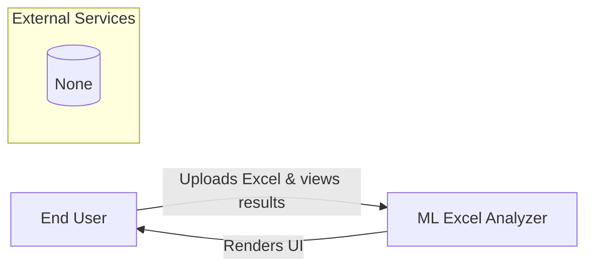
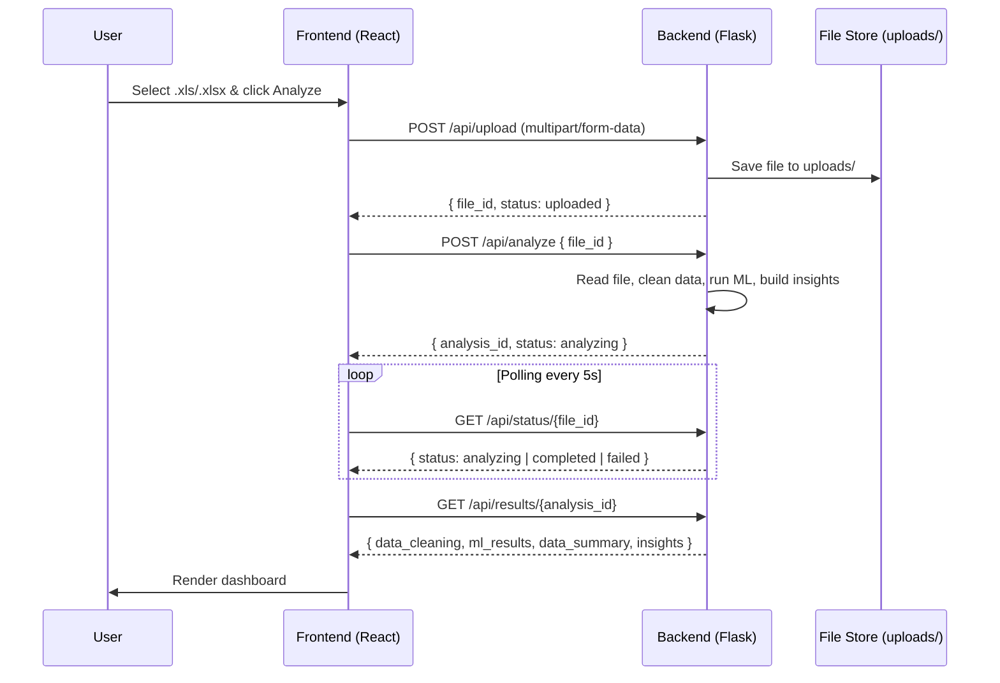
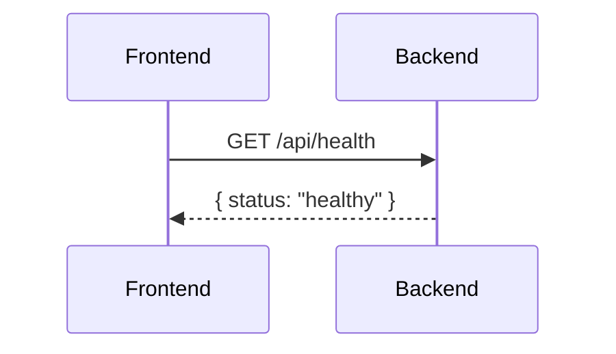
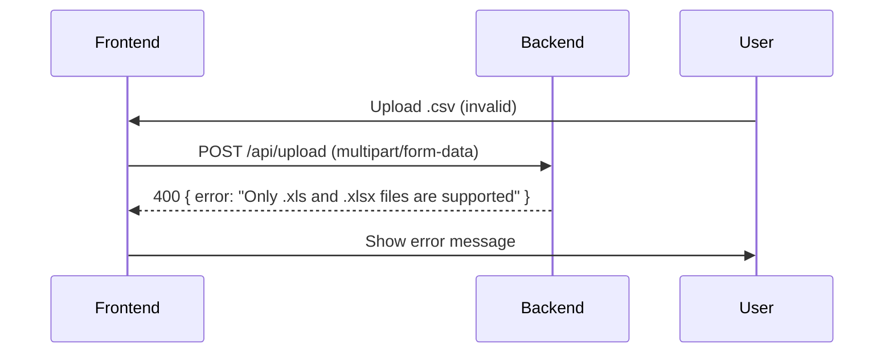

# ML Excel Analyzer — Architecture Overview

This document explains the system architecture using C4-style diagrams, key sequences, a database schema (current and proposed), and the API surface including authentication and authorization considerations.

## Context Diagram (C4 Level 1)



Scope: A single product used by an end user. No third-party integrations at present.

## Container Diagram (C4 Level 2)

```mermaid
flowchart LR
    subgraph Browser
      FE[React (Vite) Frontend]
    end
    subgraph Server
      BE[Flask API Backend]
      UP[(uploads/)]
      MEM[(In-memory status & results)]
    end

    FE <--->|HTTP/JSON via /api (Vite proxy)| BE
    BE -->|stores files| UP
    BE -->|stores analysis_status & analysis_results| MEM
```

- Frontend: React app built with Vite; calls `/api/*` endpoints.
- Backend: Flask app (`app.py`) exposes REST endpoints for upload, analysis, status, and results. CORS enabled.
- Storage: Files saved on disk under `uploads/`; analysis state and results kept in memory. No database yet.

## Sequence Diagrams (Major Scenarios)

### 1) End-to-End Analysis (Upload → Analyze → Poll → Results)



Notes: In current implementation, analysis runs during the `/api/analyze` call (no background worker). Status flips to `completed` when results are ready.

### 2) Health Check



### 3) Error Path (Invalid File Type)



## ERD / Database Schema

Current state: No database is used. The backend keeps `analysis_status` and `analysis_results` in memory and stores uploaded files on disk under `uploads/`.

Proposed relational schema (if/when persistence is needed):

```mermaid
erDiagram
  USERS ||--o{ FILES : uploads
  USERS {
    uuid id PK
    string email
    string name
    string role  // admin|user
  }

  FILES ||--o{ ANALYSES : source
  FILES {
    uuid id PK
    uuid user_id FK
    string original_filename
    string stored_path
    datetime uploaded_at
    int size_bytes
    string mime_type
  }

  ANALYSES {
    uuid id PK
    uuid file_id FK
    string status   // uploaded|analyzing|completed|failed
    datetime started_at
    datetime completed_at
    text error_message
  }

  RESULTS {
    uuid id PK
    uuid analysis_id FK
    json data_cleaning
    json ml_results
    json data_summary
    json insights
    datetime created_at
  }
```

This schema mirrors the current flow while enabling persistence, multi-user support, and auditability.

## API Endpoints

Base URL (dev): `http://localhost:5000` (Vite proxies `/api` to backend)

- `GET /api/health`
  - Purpose: Check backend availability.
  - Response: `{ status: "healthy", message: "Backend is running" }`
  - Auth: None (dev). In production, public or restricted per ops policy.

- `POST /api/upload`
  - Purpose: Upload an Excel file (`.xls` or `.xlsx` up to 100MB).
  - Request: `multipart/form-data` with `file`.
  - Success 200: `{ file_id: string, message: string, status: "uploaded", filename: string }`
  - Errors: `400` (missing/invalid file), `500` (server error).
  - Auth: None (dev). In production, require authenticated user.
  - Authorization: Any authenticated user (recommended). Optional quotas per role.

- `POST /api/analyze`
  - Purpose: Start cleaning and ML analysis for a previously uploaded file.
  - Request: JSON `{ file_id: string }`
  - Success 200: `{ analysis_id: string, message: string, status: "analyzing" }`
  - Errors: `400` (missing file_id), `404` (file not found), `500` (analysis start error).
  - Auth: None (dev). In production, require authenticated user.
  - Authorization: Only owner of the `file_id` or admins (recommended).

- `GET /api/status/{file_id}`
  - Purpose: Check analysis status for the uploaded file.
  - Response: `{ status: "uploaded" | "analyzing" | "completed" | "failed" }`
  - Errors: `404` (file not found).
  - Auth: None (dev). In production, require authenticated user.
  - Authorization: File owner or admins (recommended).

- `GET /api/results/{analysis_id}`
  - Purpose: Retrieve final results of an analysis.
  - Response: `{ data_cleaning, ml_results, data_summary, insights }`
  - Errors: `404` (analysis_id not found), `500` (serialization).
  - Auth: None (dev). In production, require authenticated user.
  - Authorization: Analysis owner or admins (recommended).

### Request/Response Structures

Types used in frontend (`src/types.ts`):

```ts
export interface UploadResponse {
  file_id: string;
  message: string;
  status: string;
}

export interface AnalysisResult {
  data_cleaning: {
    original_rows: number;
    cleaned_rows: number;
    missing_values: number;
    duplicates_removed: number;
    null_values: number;
  };
  ml_results: {
    [key: string]: {
      accuracy?: number;
      precision?: number;
      recall?: number;
      f1_score?: number;
      mse?: number;
      r2?: number;
      algorithm: string;
      type: 'classification' | 'regression' | 'clustering';
    };
  };
  data_summary: {
    columns: string[];
    data_types: { [key: string]: string };
    descriptive_stats: { [key: string]: any };
    correlations: { [key: string]: number }[];
  };
  insights: string[];
}
```

### Authentication & Authorization

- Current: No authentication/authorization implemented; CORS is open for local dev.
- Recommended:
  - Authentication: JWT-based sessions (e.g., `Authorization: Bearer <token>`).
  - Authorization: Role-based access control (`admin`, `user`).
  - Data ownership: Enforce that `file_id` and `analysis_id` are accessible only by the uploading user or admins.
  - CORS: Restrict allowed origins to the deployed frontend domain.

## Dev Proxy

Vite dev server proxies `/api` to `http://localhost:5000` (`vite.config.ts`), so frontend can call relative paths like `/api/upload` during development.

# 🚀 XLS File Analyzer - Professional Data Analysis Platform

A comprehensive full-stack web application for automated Excel file analysis with 15+ machine learning algorithms, data cleaning, and interactive dashboard visualization.

## 📊 Live Demo
**Frontend**: http://localhost:5173  
**Backend API**: http://localhost:5000  
**API Health Check**: http://localhost:5000/api/health

## 🎯 Features

### 🔧 Data Processing
- **Smart File Upload**: Drag & drop interface with 100MB file size limit
- **Automated Data Cleaning**: Handles missing values, duplicates, and null entries
- **Data Type Optimization**: Automatic column type detection and optimization
- **Outlier Detection**: Intelligent outlier handling using IQR method

### 🤖 Machine Learning Analysis
- **15+ ML Algorithms** including:
  - **Classification**: Random Forest, SVM, Logistic Regression, Gradient Boosting
  - **Regression**: Linear Regression, Ridge, Lasso, Random Forest Regressor
  - **Clustering**: K-Means, DBSCAN, Hierarchical Clustering
  - **Neural Networks**: MLP Classifier/Regressor
  - **Dimensionality Reduction**: PCA

### 📈 Interactive Dashboard
- **Real-time Analysis Progress** with step-by-step status updates
- **Data Quality Metrics** with cleaning summary and retention rates
- **ML Performance Comparison** across all algorithms
- **Interactive Charts** and visualizations
- **Key Insights** generation with actionable recommendations

## 🛠️ Technology Stack

### Frontend
- **React 18** with TypeScript
- **Vite** for fast development and building
- **Chart.js** with React-Chartjs-2 for data visualization
- **Axios** for API communication
- **CSS3** with modern responsive design

### Backend
- **Python Flask** RESTful API
- **Pandas** for data manipulation
- **Scikit-learn** for machine learning algorithms
- **Openpyxl** for Excel file processing
- **NumPy** for numerical computations

## 📁 Project Structure

```
xls-analyzer/
├── 📁 frontend/                 # React TypeScript Frontend
│   ├── src/
│   │   ├── components/
│   │   │   ├── FileUpload.tsx   # File upload with drag & drop
│   │   │   ├── Dashboard.tsx    # Analysis results dashboard
│   │   │   └── charts/
│   │   │       └── AnalysisCharts.tsx  # Data visualizations
│   │   ├── api/
│   │   │   └── analysisApi.ts   # Backend API communication
│   │   ├── types.ts             # TypeScript interfaces
│   │   ├── App.tsx              # Main application component
│   │   └── main.tsx             # Application entry point
│   ├── package.json
│   └── vite.config.ts
│
├── 📁 backend/                  # Python Flask Backend
│   ├── app.py                   # Main Flask application
│   ├── data_cleaning.py         # Data preprocessing pipeline
│   ├── ml_analysis.py           # 15+ ML algorithms implementation
│   ├── requirements.txt         # Python dependencies
│   ├── uploads/                 # Temporary file storage
│   └── results/                 # Analysis results cache
│
└── 📄 README.md                 # This file
```

## 🚀 Quick Start

### Prerequisites
- **Node.js** 16+ and **npm**
- **Python** 3.8+

### Installation & Setup

#### 1. Clone and Setup Backend
```bash
cd backend

# Create virtual environment
python -m venv venv

# Activate virtual environment
# Windows:
venv\Scripts\activate
# Mac/Linux:
source venv/bin/activate

# Install dependencies
pip install -r requirements.txt

# Start backend server
python app.py
```

#### 2. Setup Frontend (New Terminal)
```bash
cd frontend

# Install dependencies
npm install

# Start development server
npm run dev
```

#### 3. Access Application
- **Frontend**: http://localhost:5173
- **Backend API**: http://localhost:5000

## 📚 API Documentation

### Endpoints

| Method | Endpoint | Description | Request Body | Response |
|--------|----------|-------------|--------------|----------|
| `GET` | `/api/health` | Health check | - | `{"status": "healthy"}` |
| `POST` | `/api/upload` | Upload Excel file | `FormData` with file | `{"file_id": "uuid"}` |
| `POST` | `/api/analyze` | Start analysis | `{"file_id": "uuid"}` | `{"analysis_id": "uuid"}` |
| `GET` | `/api/status/<file_id>` | Check analysis status | - | `{"status": "analyzing"}` |
| `GET` | `/api/results/<analysis_id>` | Get analysis results | - | Full analysis results |

### Example API Usage

```javascript
// Upload file
const formData = new FormData();
formData.append('file', excelFile);

const uploadResponse = await fetch('http://localhost:5000/api/upload', {
  method: 'POST',
  body: formData
});

// Start analysis
const analyzeResponse = await fetch('http://localhost:5000/api/analyze', {
  method: 'POST',
  headers: { 'Content-Type': 'application/json' },
  body: JSON.stringify({ file_id: uploadResult.file_id })
});
```

## 🔬 ML Algorithms Overview

### Classification (7 Algorithms)
1. **Random Forest** - Ensemble of decision trees with feature importance
2. **Logistic Regression** - Linear classification with probability outputs
3. **Support Vector Machine (SVM)** - Maximum margin classifier
4. **Decision Tree** - Interpretable tree-based classification
5. **K-Nearest Neighbors** - Instance-based learning
6. **Naive Bayes** - Probabilistic classifier
7. **Gradient Boosting** - Sequential ensemble method

### Regression (7 Algorithms)
1. **Linear Regression** - Basic linear modeling
2. **Ridge Regression** - L2 regularization
3. **Lasso Regression** - L1 regularization with feature selection
4. **Random Forest Regressor** - Ensemble regression
5. **Gradient Boosting Regressor** - Sequential regression
6. **Support Vector Regression (SVR)** - SVM for regression
7. **Decision Tree Regressor** - Tree-based regression

### Clustering & Dimensionality Reduction
- **K-Means** - Centroid-based clustering
- **DBSCAN** - Density-based spatial clustering
- **Hierarchical Clustering** - Tree-based clustering
- **PCA** - Principal Component Analysis

## 📊 Output Metrics

### Data Cleaning Report
- **Data Retention Rate**: Percentage of rows retained after cleaning
- **Missing Values Handled**: Count of imputed missing values
- **Duplicates Removed**: Number of duplicate rows eliminated
- **Data Type Optimization**: Automatic type conversion summary

### ML Performance Metrics
- **Classification**: Accuracy, Precision, Recall, F1-Score
- **Regression**: Mean Squared Error (MSE), R² Score
- **Clustering**: Silhouette Score, Cluster Distribution
- **Cross-Validation**: 5-fold cross-validation scores

## 🎨 Dashboard Features

### Real-time Analysis
- **Progress Tracking**: Live status updates during analysis
- **Step-by-Step Visualization**: Data cleaning → ML analysis → Insights
- **Interactive Results**: Clickable elements and hover effects

### Data Visualization
- **ML Performance Charts**: Comparative algorithm performance
- **Data Quality Metrics**: Cleaning impact visualization
- **Feature Importance**: Top influential features
- **Cluster Analysis**: Data segmentation insights

### Smart Insights
- **Automated Recommendations**: Data-driven suggestions
- **Performance Analysis**: Best algorithm identification
- **Data Quality Assessment**: Comprehensive quality report

## 🔧 Configuration

### Backend Configuration
```python
# app.py
app.config['MAX_CONTENT_LENGTH'] = 100 * 1024 * 1024  # 100MB file limit
app.config['UPLOAD_FOLDER'] = 'uploads'              # File storage
app.config['RESULTS_FOLDER'] = 'results'             # Results cache
```

### Frontend Configuration
```typescript
// analysisApi.ts
const API_BASE_URL = 'http://localhost:5000/api';
const MAX_FILE_SIZE = 100 * 1024 * 1024; // 100MB
const SUPPORTED_FORMATS = ['.xls', '.xlsx'];
```

## 🐛 Troubleshooting

### Common Issues

1. **Backend Connection Failed**
   ```bash
   # Check if backend is running
   curl http://localhost:5000/api/health
   # Ensure no other service is using port 5000
   ```

2. **File Upload Fails**
   - Verify file size < 100MB
   - Check file format (.xls or .xlsx)
   - Ensure stable internet connection

3. **ML Analysis Errors**
   - Check dataset has sufficient rows (>10)
   - Verify numeric columns exist
   - Ensure target variable has variation

### Debug Mode
Enable detailed logging:
```python
# Backend - Already enabled in development
app.run(debug=True)

# Frontend - Check browser console
console.log('API responses:', response);
```

## 📈 Performance Optimization

### Backend Optimizations
- **Memory Efficient Data Processing**: Chunked file reading
- **Parallel Processing**: Background task execution
- **Result Caching**: Temporary storage of analysis results
- **Dynamic Algorithm Selection**: Adaptive ML based on data size

### Frontend Optimizations
- **Lazy Loading**: Component-based code splitting
- **Efficient Re-rendering**: React memoization
- **Optimized Charts**: Canvas-based rendering
- **Progressive Loading**: Incremental results display

## 🔒 Security Features

- **CORS Configuration**: Restricted frontend-backend communication
- **File Type Validation**: Strict Excel format checking
- **Size Limits**: Prevent server overload with file size restrictions
- **Input Sanitization**: Data validation and cleaning

## 🚀 Deployment

### Production Backend
```bash
# Use production WSGI server
pip install gunicorn
gunicorn -w 4 -b 0.0.0.0:5000 app:app
```

### Production Frontend
```bash
npm run build
# Serve built files from /dist directory
```

## 🤝 Contributing

We welcome contributions! Please see our [Contributing Guidelines](CONTRIBUTING.md) for details.

### Development Setup
1. Fork the repository
2. Create a feature branch: `git checkout -b feature/amazing-feature`
3. Commit changes: `git commit -m 'Add amazing feature'`
4. Push to branch: `git push origin feature/amazing-feature`
5. Open a Pull Request

## 📄 License

This project is licensed under the MIT License - see the [LICENSE](LICENSE) file for details.

## 🙏 Acknowledgments

- **Scikit-learn** team for comprehensive ML library
- **React** team for the fantastic frontend framework
- **Flask** team for lightweight web framework
- **Pandas** team for data manipulation tools

## 📞 Support

For support and questions:
- 📧 Email: gogo49694@gmail.com

## 🏆 Citation

If you use this project in your research, please cite:

```bibtex
@software{xls_analyzer_2024,
  title = {XLS File Analyzer: Automated Machine Learning Platform},
  author = {Your Name},
  year = {2024},
  url = {https://github.com/gasseramr}
}
```

---

<div align="center">

**⭐ Star us on GitHub if you find this project helpful!**

*Built with ❤️ for the data science community*

</div>
